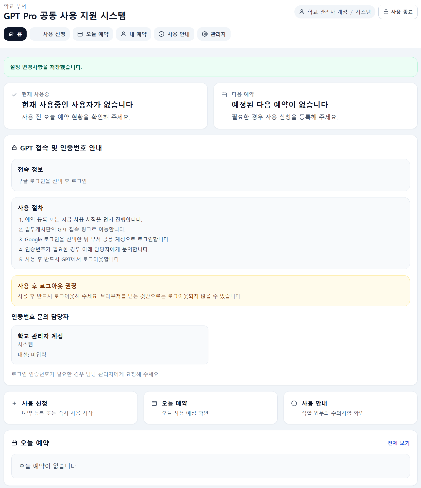
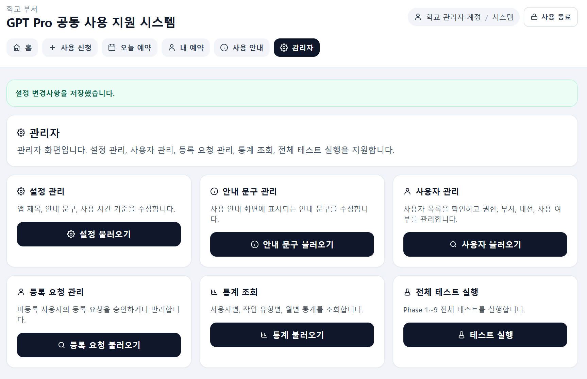
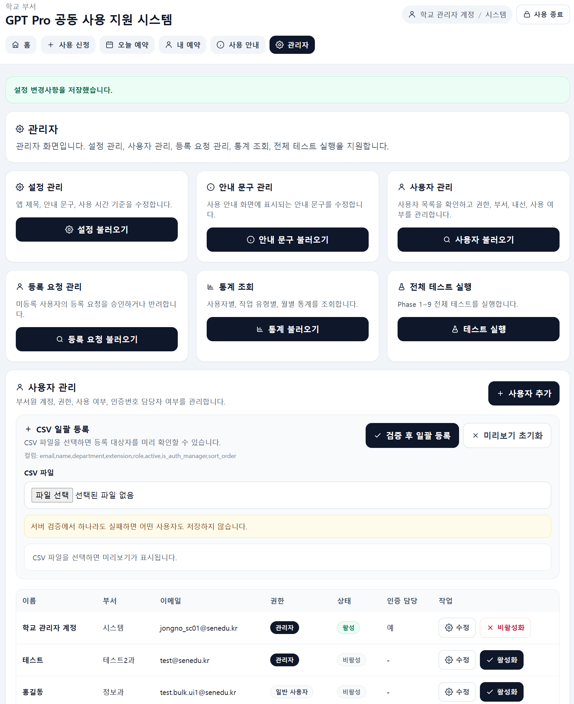
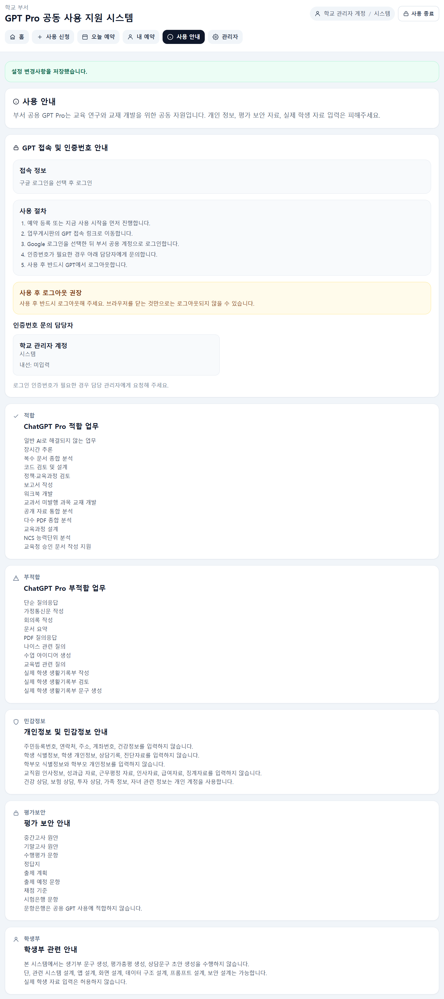
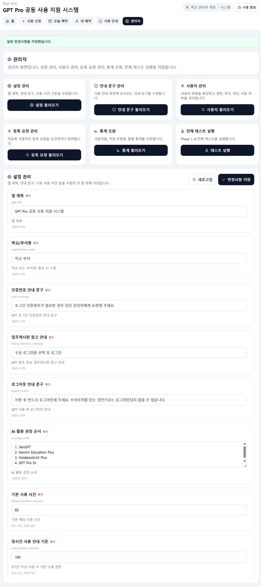

# GPT Pro 공동 사용 지원 시스템

Google Apps Script와 Google Sheets만으로 구축한 교내 GPT Pro 공동 사용 예약·관리 시스템입니다.

학교 부서에서 공동으로 사용하는 GPT Pro 계정을 안전하게 예약·관리하기 위한 내부 업무용 웹앱입니다.

---

## 프로젝트 개요

공용 GPT Pro 계정을 여러 교직원이 함께 사용하는 환경에서 발생하는 다음 문제를 해결하기 위해 개발하였습니다.

* 사용 시간 충돌
* 계정 사용 현황 확인 어려움
* 사용자 등록 관리
* 공용 계정 사용 기록 관리
* 인증번호 담당자 확인
* 공용 PC 사용 후 화면 노출 위험

별도 서버 없이 Google Apps Script Web App과 Google Sheets만으로 운영할 수 있도록 구성하였습니다.

---

## 현재 운영 버전

```text
기준일: 2026-06-23
운영 버전: Google Apps Script + Google Sheets + HTMLService
현재 상태: Phase 13-A / Phase 13-B 완료
전체 테스트: TEST_runAll 73 PASS / 0 FAIL
```

---

## 프로젝트 규모

* Google Apps Script Web App
* Google Sheets 기반 데이터 저장
* GS 파일 9개
* Client HTML 파일 7개
* 관리자 기능
* 예약 시스템
* 사용자 권한 관리
* Settings 관리
* GuideItems 관리
* CSV 사용자 일괄 등록
* 공용 PC 보안 기능
* 전체 테스트 자동화

---

## 화면 예시

### 메인 화면



### 관리자 화면



### 사용자 CSV 일괄 등록



### 안내 문구 관리



### 설정 관리



---

## 주요 기능

* 공용 GPT Pro 사용 시간 예약
* 현재 사용 중인 사용자 확인
* 예약 충돌 확인 및 조율 확인 후 저장
* 사용 시작 / 사용 완료 / 예약 취소
* 미등록 사용자 등록 요청
* 관리자 승인 / 반려
* 사용자 권한 관리
* 사용자 CSV 일괄 등록
* Settings 관리
* GuideItems 안내 문구 관리
* 공용 PC 화면 잠금 및 사용 종료 안내

---

## 기술 스택

### Frontend

* Vanilla JavaScript
* Tailwind CSS
* Google Apps Script HTMLService

### Backend

* Google Apps Script

### Database

* Google Sheets

### Authentication

* Google Workspace
* `senedu.kr` 도메인 기준

---

## 프로젝트 구조

```text
.
├── Code.js
├── appsscript.json
├── Index.html
├── Styles.html
├── Phase1_Setup.js
├── Phase2_UserAuth.js
├── Phase3_Reservations.js
├── Phase4_AppData.js
├── Phase5_StatsAndTests.js
├── Phase7_RegistrationRequests.js
├── Phase9_GuideItemsManagement.js
├── Phase9_SettingsManagement.js
├── Client_State.html
├── Client_Utils.html
├── Client_Icons.html
├── Client_Components.html
├── Client_Views.html
├── Client_Handlers.html
├── Client_App.html
├── PROJECT_STATUS.md
├── PROJECT_INSTRUCTIONS.md
├── DEVELOPMENT_LOG.md
├── docs/
└── templates/
```

---

## 테스트 결과

현재 전체 테스트 기준입니다.

```text
TEST_runAll
전체 73
PASS 73
FAIL 0
```

주요 테스트 범위:

* DB 초기화/스키마
* 사용자/권한
* 사용자 CSV 일괄 등록
* 예약 핵심 로직
* 초기 데이터 통합
* 통계/테스트 통합
* 등록 요청/승인
* 설정 관리
* 안내 문구 관리

---

## 보안 원칙

* GPT 계정 ID/PW 저장 금지
* GPT 접속 정보는 업무게시판 별도 관리
* 예약 시스템에는 업무게시판 참고 안내만 표시
* 관리자 기능 서버 권한 검증
* 사용자 등록은 `senedu.kr` 계정만 허용
* CSV 일괄 등록 서버 최종 검증
* CSV 일괄 등록 all-or-nothing 저장
* GuideItems / Settings 출력값 escape 처리
* 실제 교직원 개인정보가 포함된 CSV 업로드 금지

---

## CSV 사용자 일괄 등록

CSV 컬럼은 다음 형식을 사용합니다.

```text
email,name,department,extension,role,active,is_auth_manager,sort_order
```

검증 정책:

* `email`, `name`, `department` 필수
* `senedu.kr` 도메인만 허용
* CSV 내부 중복 이메일 방지
* 기존 사용자 이메일 중복 방지
* role 허용값 검증
* active / is_auth_manager 허용값 검증
* sort_order 0 이상 정수 검증
* 한 행이라도 실패하면 전체 저장 취소

예시 파일:

```text
templates/일괄등록.csv
```

---

## GitHub 업로드 시 제외 항목

아래 파일과 정보는 GitHub에 올리지 않습니다.

* `Client_Backup.html`
* `.clasp.json`
* `credentials*.json`
* `client_secret*.json`
* `token.json`
* 실제 교직원 개인정보가 들어간 CSV
* Google Sheet 실제 데이터 export
* 운영 Web App URL
* GPT 계정 ID/PW

---

## 문서

```text
PROJECT_STATUS.md                  현재 상태와 다음 작업 기준
PROJECT_INSTRUCTIONS.md            프로젝트 작업 원칙
DEVELOPMENT_LOG.md                 개발 과정과 의사결정 기록
docs/ARCHITECTURE.md               구조 설명
docs/OPERATIONS_GUIDE.md           운영자 사용 안내
docs/GITHUB_UPLOAD_GUIDE.md        GitHub 업로드 절차
docs/MANUAL_TEST_CHECKLIST.md      수동/서버 테스트 체크리스트
docs/ROADMAP_AND_BACKLOG.md        선택·보류·차기 버전 작업 목록
docs/SECURITY_AND_PRIVACY.md       보안/개인정보 원칙
docs/REPOSITORY_STRUCTURE.md       GitHub 저장소 구조 제안
docs/APPS_SCRIPT_FILE_INVENTORY.md Apps Script 파일 목록
docs/HANDOFF_PROMPT.md             새 대화창 인수인계 문서
```

---

## 향후 계획

### 운영 버전

* 관리자 UI 미세 정렬
* GuideItems 변경 로그 검토
* 실제 운영 데이터 기반 수동 테스트

### 포트폴리오 2차 버전

* Flask
* PostgreSQL
* OCI
* Google OAuth
* CSV 템플릿 다운로드
* 업로드 이력 관리
* 검증 로그 관리

---

## 상태

현재 Apps Script 운영 버전은 v1.0 안정화 단계입니다.

```text
Phase 13-A 완료
Phase 13-B 완료
TEST_runAll 73 PASS / 0 FAIL
```
